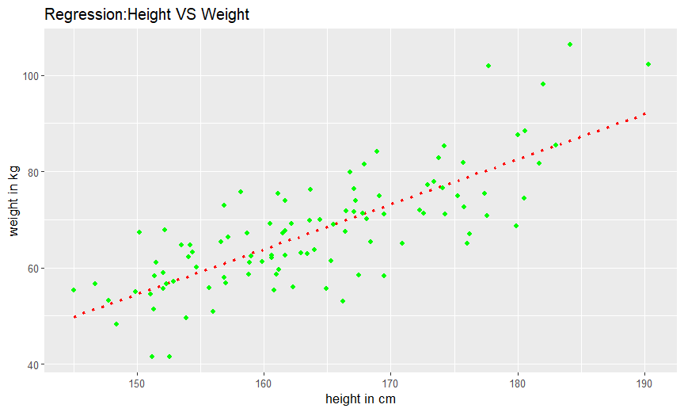
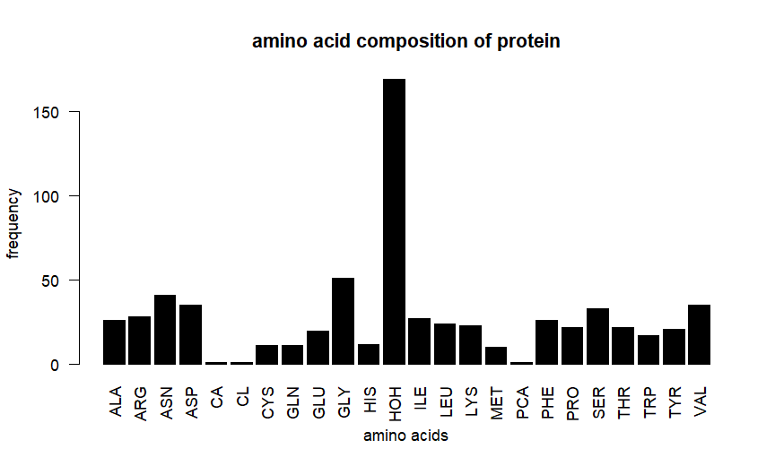
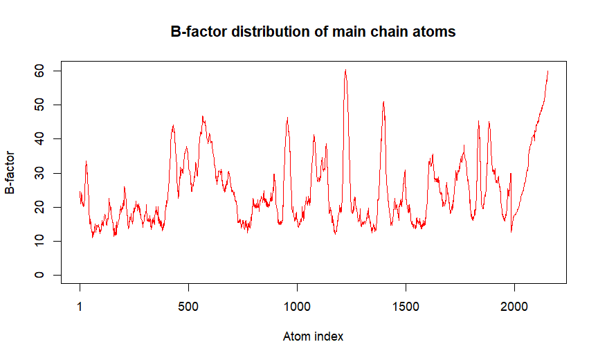
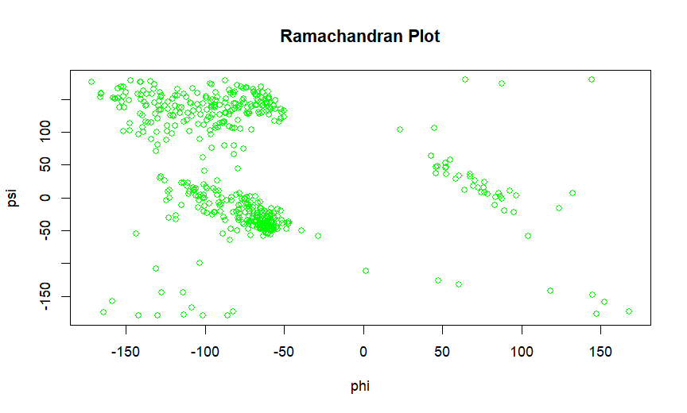
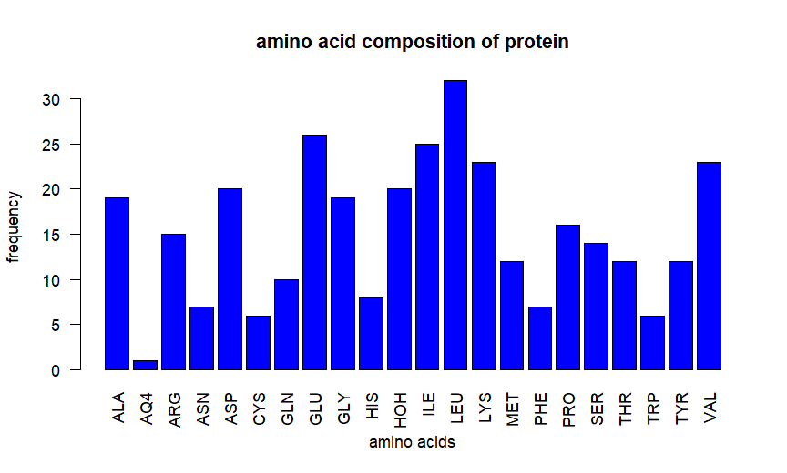
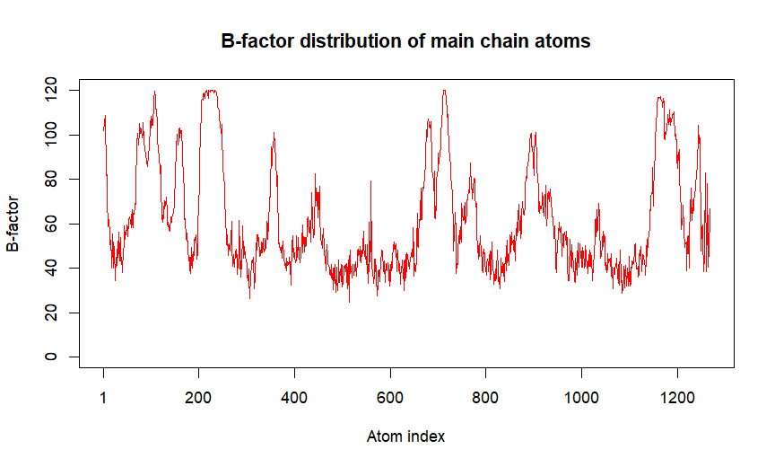
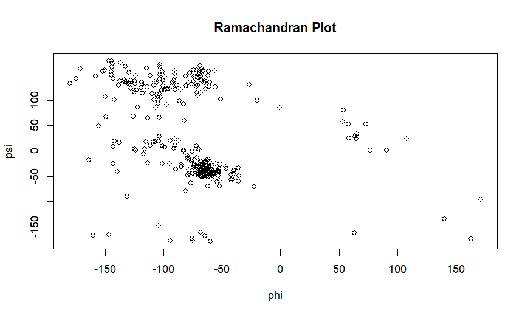

# Biostatistics using R Lab
R lab exercises related to statistical analysis of biological and physiological data.

## EXERCISE 01 Health Physiological Data Analysis
This exercise covers:
-Mean
-Median
-Mode
-Standard Deviation
-Correlation Between Height and Weight
-Data Visualization using 'ggplot2'
-Linear Regression
The dataset used for this exercise was provided by the university and is therefore not included in this repository.

## Results

### Height vs Weight Regression

## EXERCISE 02 Protein Structural Analysis

This exercise covers:
-Total Number of Amino Acids
-Amino Acid Composition
-Mean B-factor
-B-factor Distribution of Main Chain Atoms
-Ramachandran Plot
The protein structure used for this exercise was obtained from the Protein Data Bank (PDB) using PDB ID 1SMD and analyzed using the Bio3D package in R

## Results

### Amino Acid Composition

### B-factor Distribution

### Ramachandran Plot

## Independent Structural Analysis of EGFR

### Why EGFR?

EGFR (Epidermal Growth Factor Receptor) is a clinically important protein involved in cell growth and signaling. Abnormal EGFR activity is associated with several cancers, making it an important target in cancer research and drug development.

To extend the protein structural analysis learned in the practical, I independently selected an EGFR structure from the Protein Data Bank (PDB).

### Why PDB ID 1M17?

PDB ID **1M17** represents the tyrosine kinase domain of human EGFR in complex with an inhibitor. Studying this structure provides a structural perspective on an important cancer-related drug target.

### Analysis Performed

Using the **Bio3D package in R**, the EGFR structure was analyzed for:

- Total number of amino acids
- Amino acid composition
- Mean B-factor
- B-factor distribution of main-chain atoms
- Backbone φ (phi) and ψ (psi) angles using a Ramachandran plot

## Results

### EGFR Amino Acid Composition

### EGFR B-factor Distribution

### EGFR Ramachandran Plot

# EXERCISE 03 Statistical Tests and ANOVA

## Objective

To perform statistical analysis on health and physiological data using R.

## Dataset

**Dataset:** `dataset1_health_physiological.csv`

The dataset was provided as part of the Biostatistics Using R laboratory practical.

## Statistical Tests and Analyses

The following statistical analyses were performed:

1. Independent Samples t-test
2. F-test for equality of variances
3. Variance
4. Standard deviation
5. Covariance
6. Correlation
7. One-way ANOVA
8. Two-way ANOVA

## Hypotheses

### Independent Samples t-test

**H₀:** The mean BMI is equal between the sexes.

**H₁:** The mean BMI differs between the sexes.

### F-test

**H₀:** The variance of BMI is equal between the sexes.

**H₁:** The variance of BMI differs between the sexes.

### One-way ANOVA

**H₀:** The mean triglyceride level is equal across all smoking-status groups.

**H₁:** At least one smoking-status group has a different mean triglyceride level.

### Two-way ANOVA

#### Effect of Smoking Status

**H₀:** Smoking status has no significant effect on triglyceride levels.

**H₁:** Smoking status has a significant effect on triglyceride levels.

#### Effect of Physical Activity Level

**H₀:** Physical activity level has no significant effect on triglyceride levels.

**H₁:** Physical activity level has a significant effect on triglyceride levels.

#### Interaction Effect

**H₀:** There is no significant interaction between smoking status and physical activity level on triglyceride levels.

**H₁:** There is a significant interaction between smoking status and physical activity level on triglyceride levels.

## Results

* **Independent Samples t-test:** H₀ was rejected if the p-value was less than 0.05, indicating a significant difference in mean BMI between the sexes.

* **F-test:** H₀ was rejected if the p-value was less than 0.05, indicating a significant difference in BMI variance between the sexes.

* **One-way ANOVA:** H₀ was rejected if the p-value was less than 0.05, indicating that at least one smoking-status group had a different mean triglyceride level.

* **Two-way ANOVA:**

  * **Smoking Status:** H₀ was not rejected (p = 0.8130).
  * **Physical Activity Level:** H₀ was rejected (p = 0.0081).
  * **Interaction:** H₀ was rejected if the interaction p-value was less than 0.5.

Statistical tests and descriptive statistical measures were performed using R on the provided health and physiological dataset.

